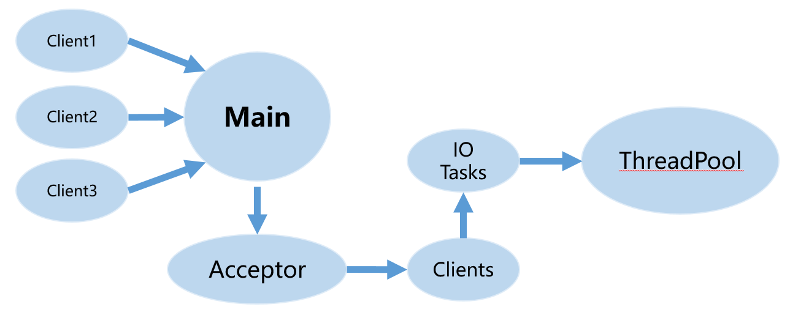
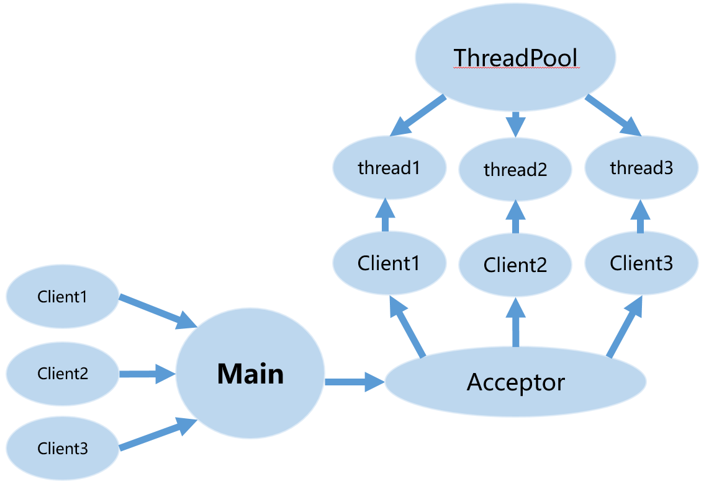
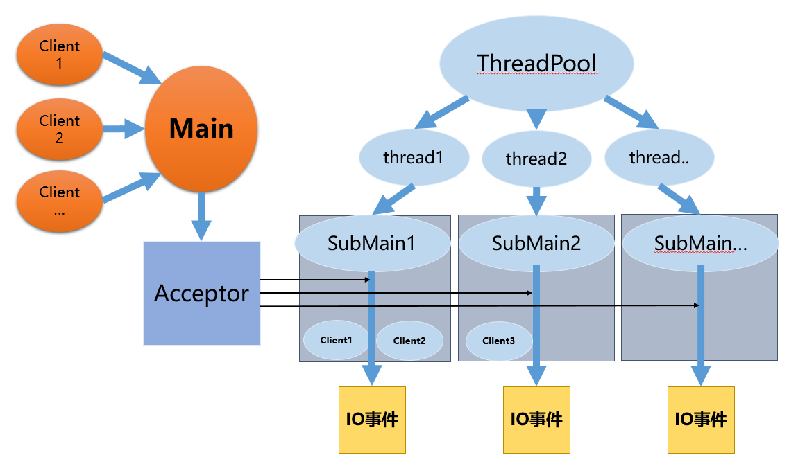

### Http version 1

对于每一个http请求(client)，会有一个fd去处理，v1版本的做法是，每当请求client到达时(即epoll检测到活动事件时)，将此活动fd的任务转交给线程池中的线程去处理

版本一的框架如下图所示：

​	

### Http version 2

这里每次有新任务到达时，就将新任务转交给线程，然后把程序的控制权转交到Epoll上，但是当在高并发状态，有很多活动的事件fd, 这是频繁的转交线程也会造成很大的开销

所以Version的初步设想是，每当有一个client到达时，利用线程池中的线程去负责这个client的fd, 然后由主线程中的epoll去通知这个线程何时开始处理任务，这样单个线程就可长期监视一个fd, 主线程就不用像Version 1一样，需要频繁地分配任务

> Note: 主线程应该如何通知单个线程要开始处理任务了呢？
>
> 1. 也就是采用线程间的通信方式（临界区、信号量、事件信号、互斥量）
> 2. 采用eventfd 的可读事件作为线程间的唤醒机制（类似于无名管道？）

由此，初步设想已经完成，但是细想发现又不是很现实，比如，一个线程去负责一个client，那在高并发状态下，这是不可能完成的任务，

简单想一想，让一个线程负责多个文件描述符很简单，用一个map维护即可，这样就可让单个线程 负责 多个文件描述符

此时的框架图如下图所示：

但是直接这样就 单个线程负责多个文件描述符 是不现实的，比如，A线程负责了 a3和a4两个文件描述符，如果主线程应该如何通知 A线程 去处理 a3和a4两个活动fd呢，这里虽然可以想办法实现（将发生活动事件的fd 作为数据写入eventfd，然后再唤醒线程），但是有没有更好的办法呢。

进一步的思考时 如何让单个线程彻头彻尾的负责多个文件描述符，彻尾很简单，负责文件描述符的close即可。彻头就是要去负责监视文件描述符的活动事件，也就是由主线程通知A线程，你应该负责a3 这个文件描述符，A线程中也应该创建epoll对象，将a3需要监听的事件加入进来。往后，可继续添加多个文件描述符。 其实这一步相当于对之前的思路做了一个调整，之前是想让主线程去监听所有事件，现在主线程只负责accept请求，然后将accept的对象的控制权转交给其余线程，至此，版本二的设想已经基本完成

版本二的基本框架如下图所示：

